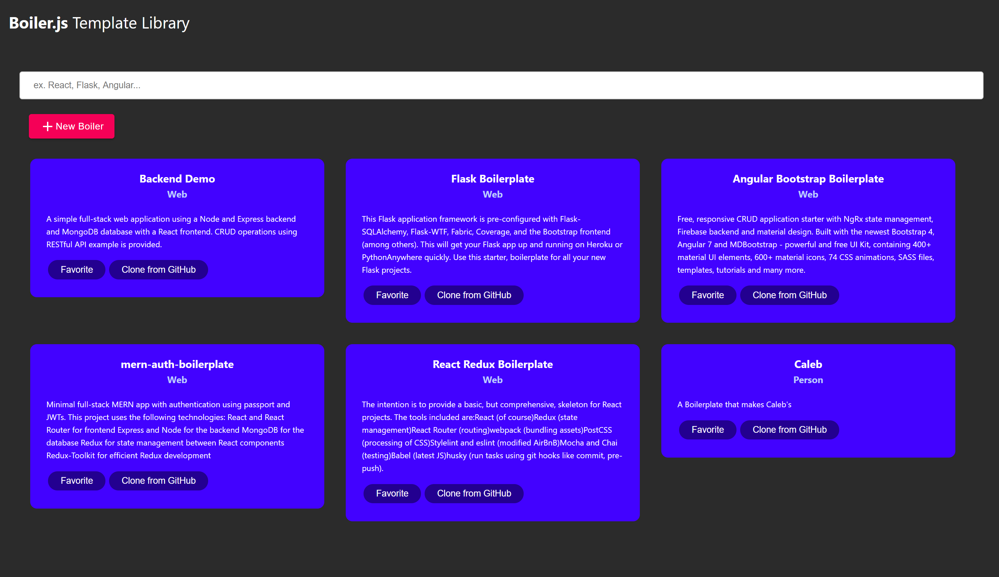
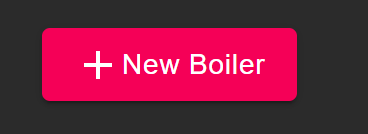
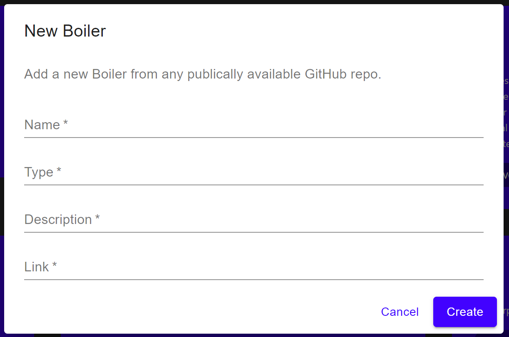
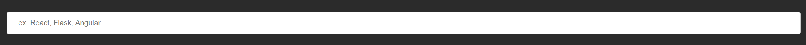
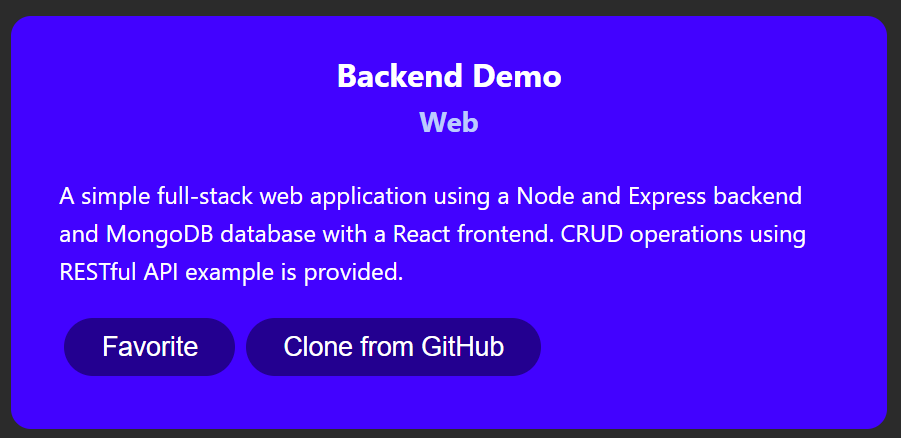

## Boiler.js :honey_pot:

 

     Boiler.js is a desktop application for software developers to quickly find and 
     set up boilerplates on their local machine with a single click
      

     

 

## Technologies Used

- [Electron.js](https://www.electronjs.org/)
- [React.js](https://reactjs.org/)
- [Express.js](https://expressjs.com/)
- [MongoDB Atlas](https://www.mongodb.com/)
- [Node.js](https://nodejs.org/en/)

 

## Installation

#### Developing

1. Clone this repo. on your local machine `git clone https://github.com/MLH-Fellowship/Boiler.js.git`
2. Navigate to the root directory in your terminal
3. Run `npm run electron-build`. This will install all the necessary packages
4. Run `npm run try`. This builds the frontend files for use in electron, then launches the desktop application.
5. Run `npm start` to launch electron after build files are created.

 

`Note`: You must run `npm run try` every time the frontend is modified in order to view your changes.

`Alternatively`: use `npm run develop` if you want to modify the code, so you can view your changes instantly.

#### Consumer Version

*add information about how to use electron as exe file*

 

## How to Use?

#### Uploading a Boiler:

1. press the `+ New Boiler` Button

     

2. fill in the required information in the modal
   - `Name`: refers to the name of your Boiler
   - `Type`: synonomous to tags, ex: React
   - `Description`: tell the world what your Boilerplate is for!
   - `Link`: to the Github repo. where your Boiler is saved

     

3. Press `Create`, and you're done

 

#### Finding and Downloading a Boiler:

1. search for what kind of Boilerplate you want

     

2. click the `Clone from Github` button, and all the work is done for you!

     

 

## Other

Devpost Submission: 

 

## Made with ❤️ by Pod 1.1.6 - the Git Geese:
|                          Lily Tang                           |                         Clara Chick                          |                          Caleb Lim                           |                          David Knox                          |
| :----------------------------------------------------------: | :----------------------------------------------------------: | :----------------------------------------------------------: | :----------------------------------------------------------: |
|  [💻](https://github.com/lilymtang) [🤝](https://www.linkedin.com/in/lilymtang/) |  [🌍](https://clarachick.me/) [💻](https://github.com/KohinaTheCat) [🤝](https://www.linkedin.com/in/clarachick/) |   [💻](https://github.com/ZzRanger) [🤝](https://www.linkedin.com/in/caleb-lim-b243a61ba/) |  [🌍](https://davidaknox.com/) [💻](https://github.com/knoxd8256) [🤝](https://www.linkedin.com/in/david-knox-developer/) |

